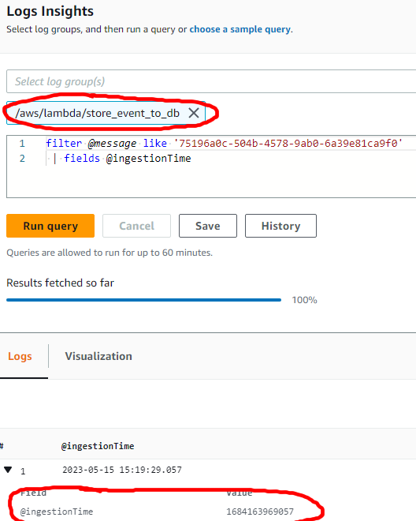

# Observability: Logs, metrics, alerts

**The goal**: your project is _observable_.

## Deliveries

### Find logs in each of three functions related to the same request

1. Get *requestId* from the *ingest_event* function logs

    

2. Find *ingestionTime* from *store_event* function log records with *message* containing the same *requestId*

    

3. Get the *store_event* function log records for given *ingestionTime*

    

4. Do 2 and 3 steps for the *store_event_to_s3* function

    
    
    

### Find built-in metrics that might help you to understand Event Stream performance

...

### Compare average execution time of functions that read from Event Stream

This task can be solved using [CloudWatch console metrics](https://docs.aws.amazon.com/lambda/latest/dg/monitoring-metrics.html)

